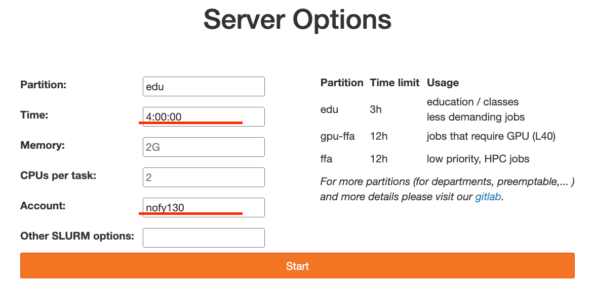
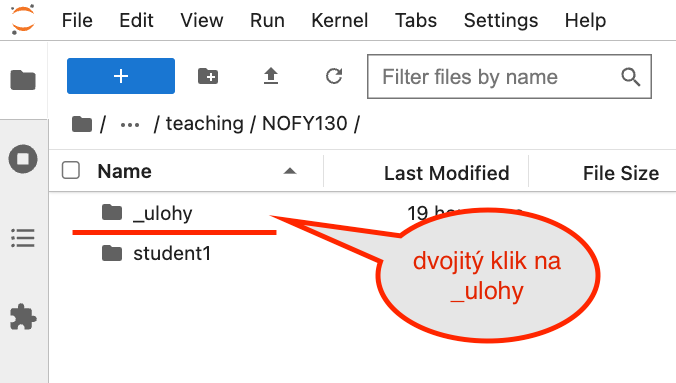
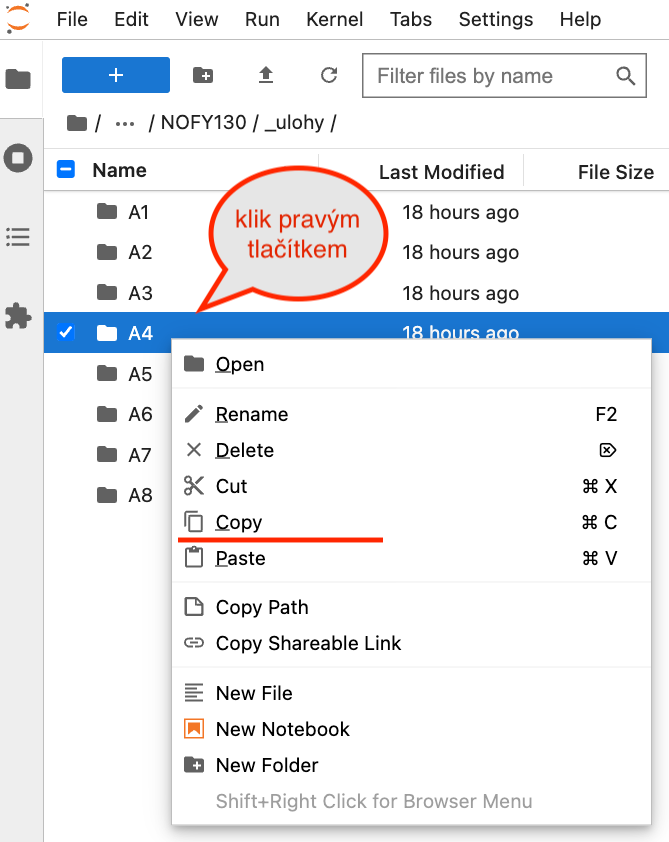
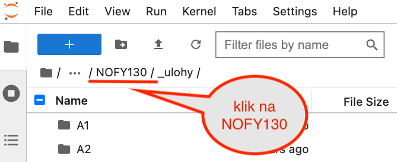
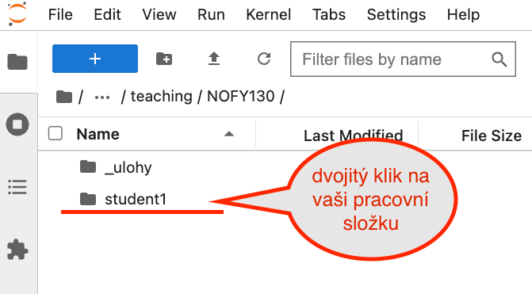
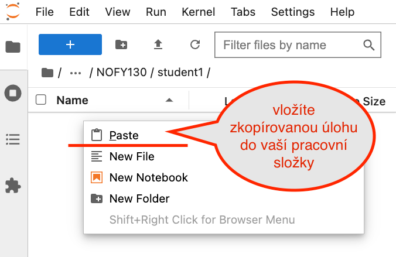
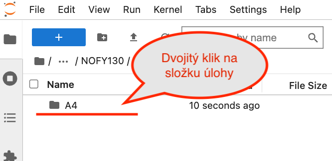
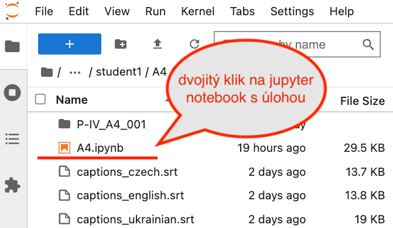
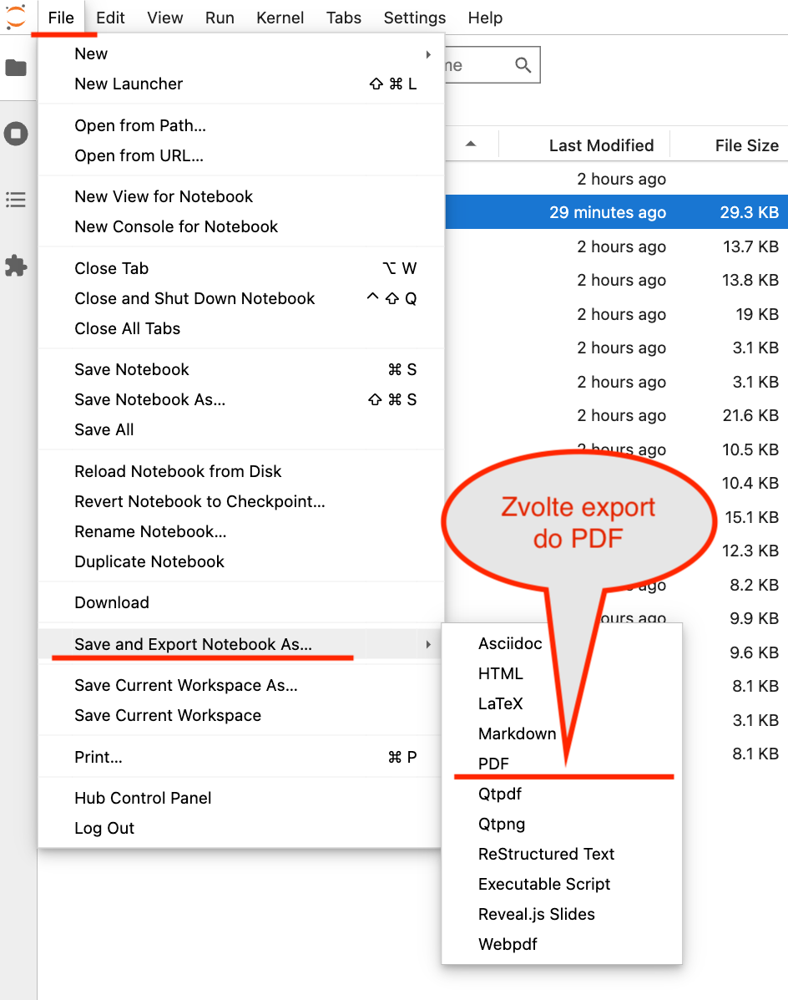

# Úvod

Jupyter notebooky pro práci v jaderné (trójské) části Fyzikálního praktika IV (NOFY130).
Každá úloha má svůj vlastní adresář s notebookem a případnými daty.
V každém z adresářů je také soubor `AX.README.md` (`X` je číslo dané úlohy) s instrukcemi k dané úloze.

## Kde notebooky spouštět

Notebooky jsou připraveny pro spuštění v JupyterHubu na výpočetním klastru MFF UK Chimera, kde je připraveno potřebné prostředí s nainstalovanými knihovnami, tzv. kernel.
Využití JupyterHubu je doporučený způsob.
Sekce [Návod pro JupyterHub](#návod-pro-jupyterhub) níže popisuje, jak s JupyterHubem pracovat.
Pokud chcete notebooky spouštět na svém počítači, je třeba si nainstalovat Python a potřebné knihovny.
Seznam potřebných knihoven naleznete pro každou úlohu v souboru `AX.README.md`.
Pokud chcete notebooky spouštět v nějaké webové aplikaci, jako je např. Google Colab, musíte si do daného prostředí nainstalovat potřebné knihovny.

## Export notebooků do PDF

Hotové notebooky je třeba exportovat do PDF a odevzdat na stránce praktika, a to stejným způsobem jako protokoly z ostatních úloh.
JupyterHub umožňuje export do PDF přímo z prostředí, viz níže.
Jiná prostředí mohou mít export do PDF omezený, nebo bude potřeba doinstalovat LaTeX a případné další nástroje.

# Návod pro JupyterHub

## Spuštění JupyterHubu a příprava notebooku k měřené úloze

1. Otevřete stránku:

   [**https://ipnp.cz/jupyter**](https://ipnp.cz/jupyter)

2. Přihlašte se pomocí vašeho účtu služeb Karlovy Univerzity

3. Spusťte JupyterHub s následujícími parametry:

   

4. V levém panelu otevřete složku s úlohami k Praktiku 4:

   /home/teaching/NOFY130/**\_ulohy**

   

5. Najděte sloužku úlohy kterou dnes měříte, klikněte pravým tlačitkem myši a zvolte “copy”. V tomto návodu použijeme např. úlohu “A4”.

   

6. Jděte zpět do složky “NOFY130” (kliknutím na NOFY130 v cestě) 

   

   a najděte **svoji pracovní složku**. Bude mít stejné jméno s jakým se přihlašujete do SIS. V tomto návodu “**student1**”

   

7. Vložte zkopírovaný adresář úlohy do vaší pracovní složky. Po pravém kliku myši zvolíte volbu “Paste”.

   

8. Nyní otevřete složku úlohy

   

    a vyberte příslušný jupyter notebook (soubor s příponou ipynb). Soubor se otevře v hlavním okně prohlížeče.

   

## Zpracování úlohy doma

Pokud nestihnete úlohu zpracovat přímo v hodině, můžete pokračovat ve zpracování doma. JupyterHub je vám k dispozici z libovolného počítače, který má připojení k internetu. 

1. Spustíte JupyterHub podle předchozích kroků 1 až 3  
2. Místo kopírování prázdného notebooku pokračujete do své pracovní složky a otevřete notebook k rozpracované úloze (krok 8 výše).

## Export notebooku do PDF

1. Pro odevzdání je třeba exportovat jupyter notebook do formátu PDF. To lze udělat přímo v JupyterHubu:  
   File → Save and Export Notebook As… → PDF

   

2. Exportovaný soubor se uloží do vašeho počítače, odkud ho můžete nahrát do systému praktika. Soubor není třeba nijak upravovat, odevzdáváte ho tak jak je na strance praktika.

   [https://physics.mff.cuni.cz/vyuka/zfp/](https://physics.mff.cuni.cz/vyuka/zfp/)

